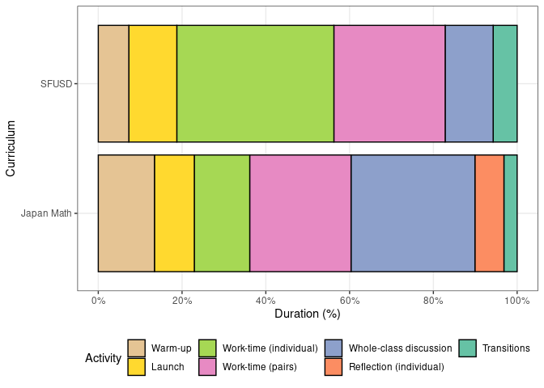

Time charts for observed lessons
================
Saurabh Khanna
2020-04-27

  - [Time charts](#time-charts)
      - [Reading in data](#reading-in-data)
      - [Graphs by grade level](#graphs-by-grade-level)
          - [Percentage time](#percentage-time)
          - [Total time](#total-time)
      - [SFUSD and JM](#sfusd-and-jm)
      - [Old graphs](#old-graphs)
          - [Percentage duration](#percentage-duration)
          - [Total duration](#total-duration)

``` r
# Libraries
library(tidyverse)
library(readxl)
```

# Time charts

## Reading in data

``` r
df <-
  tribble(
    ~school, ~teacher, ~act,                     ~time, ~grade,
    
    "S1",    "T1",     "Warm-up",                4,     4,
    "S1",    "T1",     "Launch",                 9,     4,
    "S1",    "T1",     "Work-time (individual)", 24,    4,
    "S1",    "T1",     "Whole-class discussion", 5,     4,
    "S1",    "T1",     "Transitions",            3,     4,
    
    "S1",    "T2",     "Warm-up",                2,     3,
    "S1",    "T2",     "Launch",                 8,     3,
    "S1",    "T2",     "Work-time (pairs)",      20,    3,
    "S1",    "T2",     "Whole-class discussion", 13,    3,
    "S1",    "T2",     "Transitions",             1,    3,
    
    "S2",    "T1",     "Warm-up",                8,     1,
    "S2",    "T1",     "Launch",                 5,     1,
    "S2",    "T1",     "Work-time (pairs)",      14,    1,
    "S2",    "T1",     "Whole-class discussion", 4,     1,
    "S2",    "T1",     "Transitions",             7,    1,
    
    "S3",    "T2",     "Warm-up",                12,    2,
    "S3",    "T2",     "Launch",                 11,    2,
    "S3",    "T2",     "Work-time (pairs)",      17,    2,
    "S3",    "T2",     "Whole-class discussion", 20,    2,
    "S3",    "T2",     "Transitions",             4,    2,
    
    "S3",    "T7",     "Warm-up",                9,     3,
    "S3",    "T7",     "Launch",                 10,    3,
    "S3",    "T7",     "Work-time (individual)", 23,    3,
    "S3",    "T7",     "Whole-class discussion", 29,    3,
    "S3",    "T7",     "Transitions",             4,    3
  ) %>%
  bind_rows(
    read_xlsx("data/ml_data.xlsx")
  ) %>%
  arrange(school, teacher) %>%
  mutate(
    act = act %>% factor(levels = c("Warm-up", "Launch", "Work-time (individual)", "Work-time (pairs)", "Whole-class discussion", "Reflection (individual)", "Transitions")) %>% fct_rev(),
  #  grade = grade %>% factor(levels = c("K", "1", "2", "3", "4", "5", "4/5")),
    teacher = teacher %>% fct_inorder() %>% fct_rev(),
    curriculum = if_else(school == "S3", "Japan Math", "SFUSD")
  )
```

## Graphs by grade level

### Percentage time

``` r
df %>% 
  mutate(
    teacher = teacher %>% fct_reorder2(school, grade)
  ) %>% 
  group_by(school, teacher) %>%
  mutate(
   time = time / sum(time)
  ) %>%
  ungroup %>%
  ggplot(aes(teacher, time)) +
  geom_col(aes(fill = act), position = "stack", color = "black") +
  geom_label(aes(x = teacher, y = 1.3, label = str_c("Grade ", grade)), hjust = 1) +
  scale_y_continuous(
    breaks = seq(0, 1, 0.2),
    minor_breaks = NULL,
    labels = scales::percent_format(accuracy = 1)
  ) +
  scale_fill_brewer(palette = "Set2") +
  guides(fill = guide_legend(reverse = T)) +
  theme_bw() +
  coord_flip() +
  facet_grid(vars(school), scales = "free_y") +
  labs(
    x = "Teacher",
    y = "Duration (%)",
    fill = "Activity"
  )
```

<!-- -->

### Total time

``` r
df %>% 
  mutate(
    teacher = teacher %>% fct_reorder2(school, grade)
  ) %>% 
  ggplot(aes(teacher, time)) +
  geom_col(aes(fill = act), position = "stack", color = "black") +
  geom_label(aes(x = teacher, y = 100, label = str_c("Grade ", grade)), hjust = 1) +
  scale_fill_brewer(palette = "Set2") +
  guides(fill = guide_legend(reverse = T)) +
  scale_y_continuous(
    breaks = seq(0, 100, 10)
  ) +
  coord_flip() +
  theme_bw() +
  facet_grid(vars(school), scales = "free_y") +
  labs(
    x = "Teacher",
    y = "Duration (minutes)",
    fill = "Activity"
  )
```

<!-- -->

## SFUSD and JM

``` r
df %>% 
  group_by(curriculum, act) %>% 
  summarize(
    time_mean = mean(time)
  ) %>% 
  mutate(
    time_perc = time_mean / sum(time_mean)
  ) %>% 
  ungroup() %>% 
  ggplot(aes(curriculum, time_perc, fill = act)) +
  geom_col(position = "stack", color = "black") +
  scale_y_continuous(
    breaks = seq(0, 1, 0.2),
    minor_breaks = NULL,
    labels = scales::percent_format(accuracy = 1)
  ) +
  scale_fill_brewer(palette = "Set2") +
  guides(fill = guide_legend(reverse = T)) +
  theme_bw() +
  theme(legend.position = "bottom") +
  coord_flip() +
  labs(
    x = "Curriculum",
    y = "Duration (%)",
    fill = "Activity"
  )
```

<!-- -->

## Old graphs

### Percentage duration

``` r
df %>%
  group_by(school, teacher) %>%
  mutate(
   time = time / sum(time)
  ) %>%
  ungroup %>%
  ggplot(aes(teacher, time, fill = act)) +
  geom_col(position = "stack", color = "black") +
  scale_y_continuous(
    breaks = seq(0, 1, 0.2),
    minor_breaks = NULL,
    labels = scales::percent_format(accuracy = 1)
  ) +
  scale_fill_brewer(palette = "Set2") +
  guides(fill = guide_legend(reverse = T)) +
  theme_bw() +
  coord_flip() +
  facet_grid(vars(school), scales = "free_y") +
  labs(
    x = "Teacher",
    y = "Duration (%)",
    fill = "Activity"
  )
```

<!-- -->

### Total duration

``` r
df %>%
  ggplot(aes(teacher, time, fill = act)) +
  geom_col(position = "stack", color = "black") +
  scale_fill_brewer(palette = "Set2") +
  guides(fill = guide_legend(reverse = T)) +
  scale_y_continuous(
    breaks = seq(0, 80, 10)
  ) +
  coord_flip() +
  theme_bw() +
  facet_grid(vars(school), scales = "free_y") +
  labs(
    x = "Teacher",
    y = "Duration (minutes)",
    fill = "Activity"
  )
```

<!-- -->
