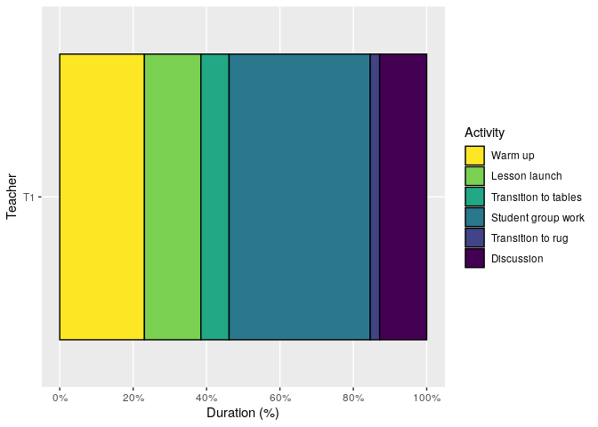

Bar graphs for observed lessons
================
Saurabh Khanna
2020-04-14

  - [Bar graphs](#bar-graphs)
      - [Percentage](#percentage)

``` r
# Libraries
library(tidyverse)
```

# Bar graphs

## Percentage

``` r
tribble(
  ~school, ~teacher, ~act,           ~time,
  "S2",    "T1",     "Launch",       15,
  "S2",    "T1",     "Student work", 15,
  "S2",    "T1",     "Discussion",   5
) %>% 
  mutate(
    act = act %>% fct_inorder() %>% fct_rev()
  ) %>% 
  ggplot(aes(teacher, time, fill = act)) +
  geom_col(position = "stack") +
  coord_flip()
```

<!-- -->
